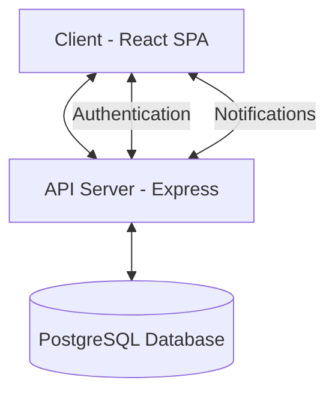
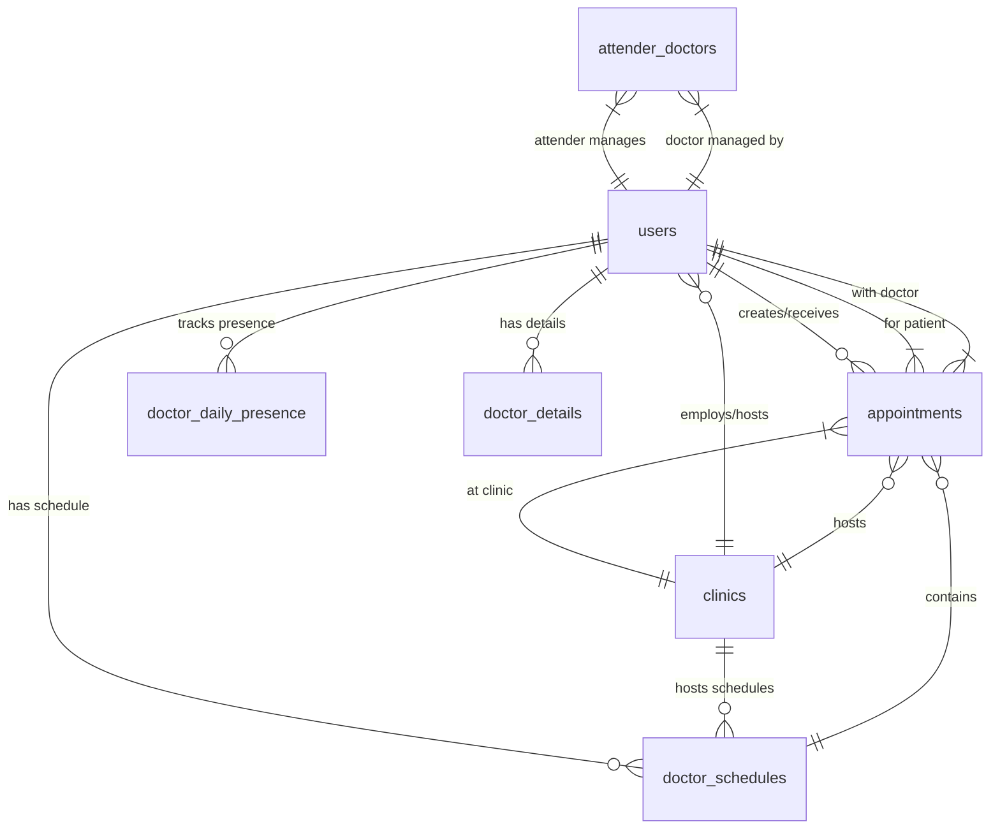
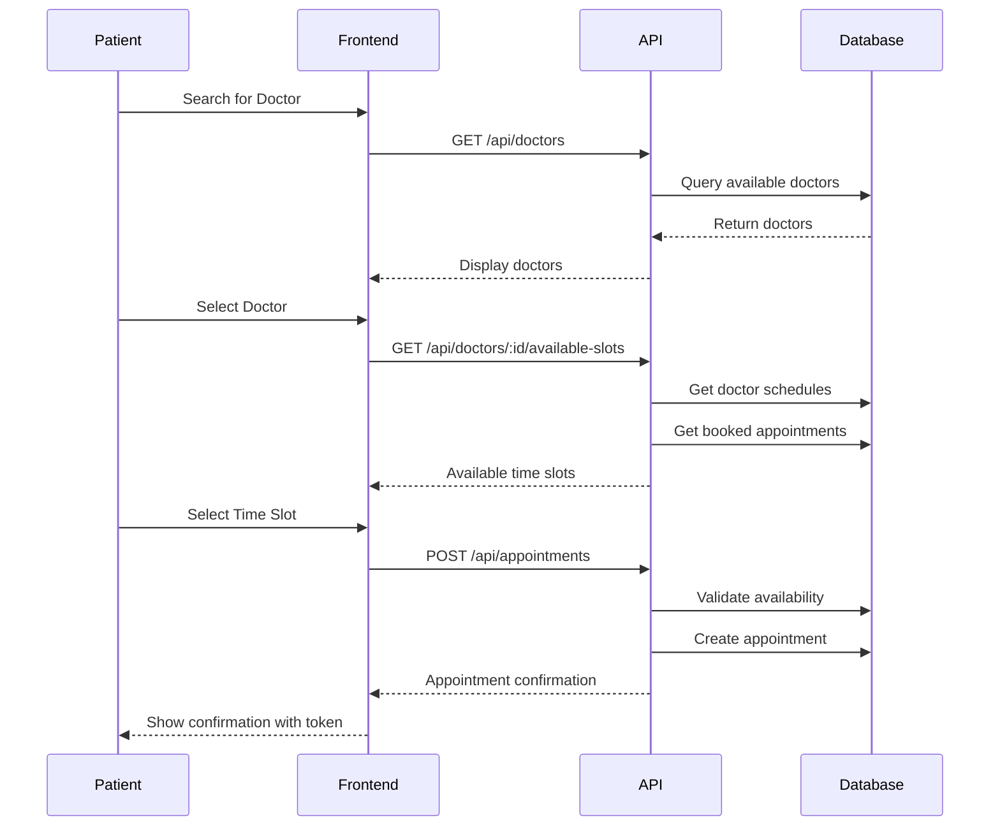
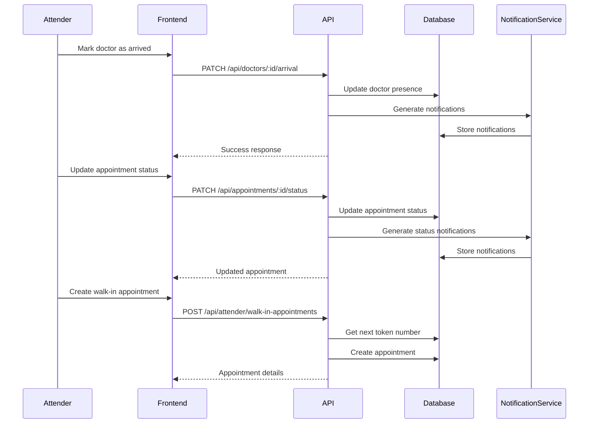

# ClinicFlow Developer Documentation

## Table of Contents

1. [Introduction](#introduction)
2. [System Architecture](#system-architecture)
3. [Technology Stack](#technology-stack)
4. [Project Structure](#project-structure)
5. [Database Schema](#database-schema)
6. [Core Components](#core-components)
7. [API Reference](#api-reference)
8. [Authentication System](#authentication-system)
9. [Key Workflows](#key-workflows)
10. [Component Overview](#component-overview)
11. [Development Guidelines](#development-guidelines)
12. [Testing](#testing)
13. [Troubleshooting](#troubleshooting)

## System Architecture

ClinicFlow follows a client-server architecture with a React frontend and Node.js Express backend:



The system consists of these major components:

1. **Frontend (Client)**: Single-page React application with client-side routing and state management
2. **Backend (Server)**: Express.js API server with RESTful endpoints
3. **Database**: PostgreSQL with Drizzle ORM
4. **Authentication**: Session-based authentication with cookies
5. **Notification System**: Real-time status updates and alerts

## Database Schema

The database schema consists of several key tables that form the foundation of the application:

### Core Tables

- **users**: Stores all user types (patients, doctors, attenders, admins)
- **clinics**: Clinic information and locations
- **appointments**: Appointment records with status tracking
- **doctor_schedules**: Doctor working hours configuration
- **doctor_daily_presence**: Tracks whether doctors have arrived
- **notifications**: System notifications for users

## Project Structure

The ClinicFlow project follows a well-organized structure with clear separation between client and server components:

```
ClinicFlow/
├── .env                  # Environment variables (not tracked in version control)
├── .env.example          # Example environment variables template
├── .gitignore            # Git ignore rules
├── .replit               # Replit configuration
├── Application_Flow.md   # High-level application architecture documentation
├── README.md             # Project overview and setup instructions
├── drizzle.config.ts     # Drizzle ORM configuration
├── package.json          # NPM package definition and scripts
├── postcss.config.js     # PostCSS configuration for Tailwind
├── tailwind.config.ts    # Tailwind CSS configuration
├── theme.json            # UI theme configuration
├── tsconfig.json         # TypeScript configuration
├── vite.config.ts        # Vite bundler configuration
│
├── client/               # Frontend codebase
│   ├── index.html        # HTML entry point
│   └── src/              # Frontend source code
│       ├── App.tsx       # Main React application component
│       ├── main.tsx      # Application entry point
│       ├── index.css     # Global CSS styles
│       ├── components/   # Reusable UI components
│       │   ├── ProtectedRoute.tsx          # Route protection component
│       │   ├── appointment-actions.tsx     # Appointment control buttons
│       │   ├── appointment-status-badge.tsx # Status indicators
│       │   ├── create-appointment-modal.tsx # Walk-in appointment creation
│       │   ├── doctor-card.tsx             # Doctor information display
│       │   ├── nav-header.tsx              # Navigation header
│       │   ├── notifications/              # Notification-related components
│       │   ├── search-filters.tsx          # Doctor search filters
│       │   └── ui/                         # Base UI components (ShadCN)
│       ├── hooks/        # Custom React hooks
│       ├── lib/          # Utility functions and services
│       └── pages/        # Page components
│           ├── attender-dashboard.tsx      # Attender dashboard
│           ├── auth-page.tsx               # Login/registration
│           ├── booking-history.tsx         # Appointment history
│           ├── booking-page.tsx            # Main booking flow
│           ├── doctor-booking-page.tsx     # Doctor schedule view
│           ├── doctor-management.tsx       # Doctor profile management
│           ├── doctor-page.tsx             # Doctor profile page
│           ├── doctor-schedules.tsx        # Schedule management
│           ├── home-page.tsx               # Main landing page
│           ├── not-found.tsx               # 404 error page
│           ├── patient-booking-page.tsx    # Patient booking interface
│           └── patient-dashboard.tsx       # Patient dashboard
│
├── server/               # Backend codebase
│   ├── auth.ts           # Authentication logic
│   ├── create-test-attender.ts # Test data creation
│   ├── db.ts             # Database connection
│   ├── index.ts          # Server entry point
│   ├── routes.ts         # API routes definition
│   ├── storage.ts        # Data access layer
│   ├── vite.ts           # Vite server configuration
│   └── services/         # Backend services
│       └── notification.ts # Notification service
│
├── shared/               # Shared code between client and server
│   └── schema.ts         # Database schema definition and types
│
├── migrations/           # Database migration scripts
├── scripts/              # Utility scripts
│   └── reset-password.ts # Password reset tool
└── public/               # Static assets
```

### Key Directories and Files

#### Client-side

- **components/**: Reusable UI components
  - **ui/**: Base UI components using ShadCN
  - **notifications/**: Notification-related components
  
- **pages/**: Page-level components corresponding to different routes
  - Pages for patients, doctors, and attenders
  
- **hooks/**: Custom React hooks
  - API data fetching hooks
  - Authentication hooks
  - Form handling hooks
  
- **lib/**: Utility functions and services
  - API client
  - Date handling utilities
  - Validation helpers

#### Server-side

- **auth.ts**: Authentication system using Passport.js
- **routes.ts**: API endpoint definitions
- **storage.ts**: Data access layer with all database operations
- **services/**: Backend service modules
  - **notification.ts**: Notification generation and management

#### Shared

- **schema.ts**: Database schema definitions using Drizzle ORM
  - Table definitions
  - Relations
  - TypeScript types
  - Validation schemas

#### Configuration

- **.env**: Environment variables
- **drizzle.config.ts**: ORM configuration
- **tsconfig.json**: TypeScript settings
- **vite.config.ts**: Build configuration

### Module Organization

The codebase follows these organizational principles:

1. **Feature-based Organization**: Components and pages are organized by feature or user role

2. **Shared Components**: Common UI elements are in the components directory

3. **Clear Separation**: Backend and frontend code are clearly separated

4. **Type Sharing**: Types are defined in shared/ and used by both client and server

5. **Service Pattern**: Backend functionality is organized into focused service modules

## Technology Stack

### Frontend
- **Framework**: React 18
- **State Management**: TanStack Query (React Query)
- **Routing**: Wouter
- **UI Components**: ShadCN UI (based on Radix UI)
- **Styling**: Tailwind CSS
- **Form Handling**: React Hook Form with Zod validation
- **HTTP Client**: Native fetch API with query client wrapper

### Backend
- **Runtime**: Node.js
- **Framework**: Express.js
- **Database ORM**: Drizzle ORM
- **Authentication**: Passport.js with session-based auth
- **Validation**: Zod
- **Environment Management**: dotenv

### Database
- **Database**: PostgreSQL
- **Migration Tool**: Drizzle Kit
- **Connection Pool**: pg

### Development Tools
- **Language**: TypeScript
- **Build Tool**: Vite
- **Server Bundling**: esbuild
- **Development Server**: tsx

## Introduction

ClinicFlow is a comprehensive clinic management system designed to streamline the patient booking process and optimize clinic operations. The application connects patients, doctors, and clinic staff through a unified platform that manages appointments, tracks doctor availability, and provides real-time notifications.

### Key User Roles

- **Patients**: Book and manage appointments with doctors
- **Doctors**: View and manage scheduled appointments
- **Attenders (Clinic Staff)**: Manage doctor presence, appointment statuses, and walk-in patients
- **Hospital Administrators**: Configure clinic settings and oversee operations

### Table Relationships



### Key Fields by Table

#### users
- `id`: Primary key
- `name`: User's full name
- `username`: Unique login identifier
- `password`: Hashed password
- `role`: User type ("patient", "doctor", "attender", "hospital_admin")
- `phone`: Contact phone number
- `email`: Email address (optional)
- `specialty`: Doctor's specialty (only for doctor role)
- `clinicId`: Associated clinic

#### clinics
- `id`: Primary key
- `name`: Clinic name
- `address`: Street address
- `city`, `state`, `zipCode`: Location information
- `phone`, `email`: Contact information

#### appointments
- `id`: Primary key
- `patientId`: Patient user ID (null for walk-ins)
- `doctorId`: Doctor user ID
- `clinicId`: Clinic ID
- `date`: Appointment date and time
- `tokenNumber`: Queue position number
- `status`: Current status (scheduled, start, hold, cancel, completed)
- `guestName`, `guestPhone`: For walk-in appointments
- `isWalkIn`: Flag for walk-in vs. pre-booked

#### doctor_schedules
- `id`: Primary key
- `doctorId`: Doctor user ID
- `clinicId`: Clinic ID
- `dayOfWeek`: Day number (0-6 for Sunday-Saturday)
- `startTime`, `endTime`: Schedule hours in 24-hour format
- `isActive`: Whether the schedule is active
- `maxTokens`: Maximum appointments per schedule

#### doctor_daily_presence
- `id`: Primary key
- `doctorId`: Doctor user ID
- `clinicId`: Clinic ID
- `scheduleId`: Associated schedule ID
- `date`: The specific date
- `hasArrived`: Whether the doctor has arrived at the clinic

## API Reference

### Authentication Endpoints
- `POST /api/login`: Authenticate user
- `POST /api/register`: Register new user
- `POST /api/logout`: End user session
- `GET /api/me`: Get current user information

### Doctor Endpoints
- `GET /api/doctors`: List all doctors (with optional filtering)
- `GET /api/doctors/:id`: Get specific doctor details
- `GET /api/doctors/:id/schedules`: Get doctor's schedule
- `POST /api/doctors/:id/schedules`: Create new schedule
- `PATCH /api/doctors/schedules/:id`: Update schedule
- `DELETE /api/doctors/schedules/:id`: Remove schedule
- `GET /api/doctors/:id/availability`: Check doctor availability
- `PATCH /api/doctors/:id/arrival`: Update doctor arrival status
- `GET /api/doctors/:id/token-progress`: Get current token status
- `GET /api/doctors/:id/available-slots`: Get available appointment slots
- `GET /api/doctors/:id/details`: Get doctor professional details
- `PATCH /api/doctors/:id/details`: Update doctor details
- `PATCH /api/doctors/:id/status`: Enable/disable doctor
- `PATCH /api/doctors/:id`: Update doctor profile

### Appointment Endpoints
- `GET /api/appointments`: Get user appointments (role-specific)
- `POST /api/appointments`: Create new appointment
- `PATCH /api/appointments/:id/status`: Update appointment status
- `GET /api/patient/appointments`: Get patient's appointments
- `GET /api/doctor/appointments`: Get doctor's appointments
- `POST /api/attender/walk-in-appointments`: Create walk-in appointment

### Clinic Endpoints
- `GET /api/clinics`: List all clinics
- `GET /api/clinics/:clinicId/available-doctors`: Find available doctors by clinic
- `GET /api/clinics/:clinicId/schedules`: Get schedules for a clinic

### Notification Endpoints
- `GET /api/notifications`: Get unread notifications
- `GET /api/notifications/all`: Get all notifications (paginated)
- `PATCH /api/notifications/:id/read`: Mark notification as read
- `POST /api/notifications/read-all`: Mark all notifications as read
- `DELETE /api/notifications/:id`: Delete notification

## Authentication System

ClinicFlow uses session-based authentication with cookies:

1. **Login Flow**:
   - User submits credentials
   - Server verifies username/password
   - Server creates session and sets cookie
   - Session information is stored in the database

2. **Session Management**:
   - Sessions are stored in PostgreSQL
   - Cookie contains encrypted session ID
   - Sessions expire after configured timeout

3. **Authorization**:
   - Role-based access control
   - Middleware checks user role for protected routes
   - Routes verify permissions based on user role

## Key Workflows

### Appointment Booking Flow



### Appointment Management Flow (Attender)



### Token Progress Calculation

1. System tracks the current token being processed for each doctor
2. For patients waiting, system calculates:
   - Token difference (patient token - current token)
   - Additional factor for walk-in patients that might be ahead
   - Status-based adjustments (canceled appointments are skipped)
3. Frontend displays estimated waiting time and tokens ahead

## Component Overview

### Frontend Components

#### Authentication Components
- `auth-page.tsx`: Login and registration forms
- `ProtectedRoute.tsx`: Route guard for authenticated pages

#### Patient-facing Components
- `home-page.tsx`: Main landing page with doctor search
- `booking-page.tsx`: Appointment booking flow
- `patient-dashboard.tsx`: Patient appointment history

#### Doctor Components
- `doctor-page.tsx`: Doctor profile page
- `doctor-booking-page.tsx`: Doctor's daily schedule

#### Attender Components
- `attender-dashboard.tsx`: Attender dashboard for clinic management
- `appointment-actions.tsx`: Appointment status control buttons
- `create-appointment-modal.tsx`: Walk-in appointment creation

#### Shared Components
- `nav-header.tsx`: Navigation header with user menu
- `doctor-card.tsx`: Doctor information display
- `appointment-status-badge.tsx`: Visual status indicators

### Backend Services

#### Storage Service
Handles all database operations through structured methods:
- User management
- Appointment booking
- Token tracking
- Schedule management

#### Notification Service
Responsible for managing and delivering notifications:
- Creating notifications for events
- Fetching user notifications
- Marking notifications as read/unread
- Generating status update notifications

## Development Guidelines

### Adding New Features

1. **Define the feature requirements**:
   - What problem does it solve?
   - Which user roles will interact with it?
   - What database changes are needed?

2. **Update the database schema**:
   - Add new tables/columns in `shared/schema.ts`
   - Create migration files

3. **Implement backend endpoints**:
   - Add new routes in `server/routes.ts`
   - Add storage methods in `server/storage.ts`
   - Add validation using Zod schemas

4. **Create frontend components**:
   - Add new pages or components
   - Implement data fetching with React Query
   - Add form handling with React Hook Form
   - Update navigation as needed

5. **Add notifications (if applicable)**:
   - Implement notification triggers
   - Create notification types
   - Update UI notification display

### Code Style Guidelines

- Use TypeScript for all new code
- Follow naming conventions:
  - camelCase for variables and functions
  - PascalCase for components and classes
  - snake_case for database fields
- Organize imports by category
- Use async/await for asynchronous code
- Validate all inputs with Zod schemas
- Document complex functions with comments

### Best Practices

- Use React Query for data fetching
- Implement proper error handling
- Handle loading states with skeleton components
- Follow RESTful API conventions
- Keep components focused on a single responsibility
- Use middleware for authentication checks
- Test all API endpoints with different user roles

## Testing

### Manual Testing Procedures

1. **Authentication Testing**:
   - Test login with valid credentials
   - Test login with invalid credentials
   - Test session persistence
   - Verify protected routes

2. **Appointment Flow Testing**:
   - Test doctor search functionality
   - Book appointments with different doctors
   - Test appointment cancellation
   - Verify token number assignment

3. **Attender Dashboard Testing**:
   - Test doctor arrival toggle
   - Verify appointment status updates
   - Test walk-in appointment creation
   - Verify token progress calculation

4. **Notification Testing**:
   - Verify status change notifications
   - Test doctor arrival notifications
   - Check "next in line" notifications
   - Verify notification read/unread status

### Common Issues

1. **Token Calculation Issues**:
   - Check logic in storage.getCurrentTokenProgress
   - Verify appointment status filtering
   - Ensure walk-in patients are counted correctly

2. **Schedule Conflicts**:
   - Verify schedule validation logic
   - Check doctor availability queries
   - Ensure proper timezone handling

3. **Notification Delivery**:
   - Check polling configuration
   - Verify notification creation in database
   - Ensure user IDs are correctly associated

## Troubleshooting

### Database Connection Issues
- Verify DATABASE_URL in .env file
- Check PostgreSQL server status
- Ensure database migrations have been applied
- Verify connection pooling configuration

### Authentication Problems
- Check SESSION_SECRET in .env file
- Verify cookie settings (secure, httpOnly)
- Check session table in database
- Ensure password hashing is working correctly

### Appointment Booking Failures
- Check for schedule conflicts
- Verify token limit configuration
- Ensure correct date/time handling
- Check for database constraint violations

### Token Progress Issues
- Verify appointment status tracking
- Check current token calculation logic
- Ensure walk-in appointments are properly flagged
- Test with various appointment scenarios
