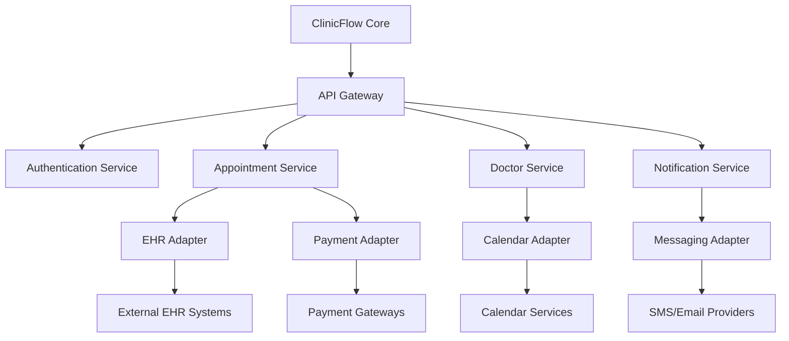

# ClinicFlow Integration Points & API Extensions

## Overview

This document outlines potential integration points and API extensions for the ClinicFlow application. These can be used to enhance functionality, integrate with external systems, and extend the platform for future requirements.

## API Extension Opportunities

### Public API Endpoints

The following endpoints could be exposed as part of a public API for integrations:

#### Authentication API
- `POST /api/auth/token`: Generate an API token for third-party applications
- `GET /api/auth/validate`: Validate an API token
- `DELETE /api/auth/revoke`: Revoke an API token

#### Doctor Directory API
- `GET /api/public/doctors`: Get a list of doctors (filterable, paginated)
- `GET /api/public/doctors/:id`: Get public doctor information
- `GET /api/public/specialties`: Get list of available specialties
- `GET /api/public/clinics`: Get a list of clinics

#### Appointment API
- `GET /api/public/available-slots`: Search available appointment slots
- `POST /api/public/appointments`: Create an appointment
- `PATCH /api/public/appointments/:id`: Update an appointment
- `GET /api/public/appointments/:id/status`: Check appointment status

### Webhook Support

Implementing webhooks would allow external systems to receive real-time updates:

1. **Appointment Webhooks**:
   - Appointment created
   - Appointment updated
   - Appointment cancelled
   - Appointment completed

2. **Doctor Webhooks**:
   - Doctor arrived
   - Doctor schedule updated
   - Doctor availability changed

3. **Token Webhooks**:
   - Token progress updated
   - Current token changed

## Integration Opportunities

### Electronic Health Record (EHR) Integration

Integration with EHR systems would enhance the clinical value of ClinicFlow:

1. **Patient Record Integration**:
   - Pull basic patient demographics
   - Access medical history
   - Retrieve allergies and medications
   - Sync appointment information

2. **Implementation Approach**:
   - Implement HL7 FHIR standard for healthcare data exchange
   - Create adapter services for popular EHR systems
   - Implement secure OAuth2 authentication
   - Provide bidirectional synchronization

### Payment Gateway Integration

Adding payment processing would enable:

1. **Features**:
   - Online appointment booking fees
   - Consultation payment
   - Invoicing and receipts
   - Payment history tracking

2. **Potential Gateways**:
   - Stripe
   - PayPal
   - Razorpay
   - Local payment processors

3. **Implementation Requirements**:
   - Secure payment processing
   - Transaction recording
   - Receipt generation
   - Refund handling

### SMS and Email Notification Services

Extending notifications beyond in-app alerts:

1. **SMS Integration**:
   - Appointment reminders
   - Doctor arrival notifications
   - Token progress alerts
   - Status change notifications

2. **Email Integration**:
   - Appointment confirmations
   - Detailed reports
   - Monthly summaries
   - Administrative notifications

3. **Implementation Options**:
   - Twilio for SMS
   - SendGrid/Mailgun for email
   - Custom SMTP integration
   - Template system for notifications

### Calendar Integration

Syncing with external calendar systems:

1. **Supported Calendars**:
   - Google Calendar
   - Microsoft Outlook
   - Apple Calendar
   - Other iCal compatible systems

2. **Features**:
   - Two-way synchronization
   - Appointment details
   - Reminders and alerts
   - Availability checking

### Telemedicine Integration

Adding virtual consultation capabilities:

1. **Features**:
   - Video consultation
   - Secure messaging
   - Document sharing
   - Virtual waiting room

2. **Integration Options**:
   - Custom WebRTC implementation
   - Zoom API integration
   - Twilio Video
   - Microsoft Teams or Google Meet

### Lab and Diagnostic Integration

Connecting with laboratory and diagnostic centers:

1. **Features**:
   - Test ordering
   - Result viewing
   - Report integration
   - Electronic requisitions

2. **Implementation Approach**:
   - HL7 or FHIR standards for medical data
   - Lab-specific APIs
   - Secure document transfer
   - Result notification system

## Data Exchange Standards

For seamless integrations, the following standards should be implemented:

1. **Healthcare Data**:
   - HL7 FHIR for medical data exchange
   - DICOM for imaging (if applicable)
   - CCDA for clinical documents

2. **General Data**:
   - REST API with JSON payloads
   - OAuth2 for authentication
   - OpenAPI/Swagger specifications
   - JWT for tokens

## Technical Implementation Requirements

### API Gateway

Implementing an API gateway would provide:
- Rate limiting
- Authentication
- Request validation
- Logging and monitoring
- API versioning

### Identity Provider

Enhanced authentication options:
- OAuth2/OpenID Connect
- Multi-factor authentication
- Single sign-on (SSO)
- Role-based access control

### Data Pipeline

For analytics and reporting:
- ETL processes for data extraction
- Data warehousing
- Business intelligence tools
- Reporting engines

## Integration Architecture

A microservices approach to integration would include:

## Implementation Roadmap

### Phase 1: API Foundation
1. Create comprehensive API documentation
2. Implement API authentication
3. Develop core public endpoints
4. Set up API gateway

### Phase 2: Basic Integrations
1. Implement email notifications
2. Add SMS notification capability
3. Develop calendar synchronization
4. Create payment processing

### Phase 3: Advanced Healthcare Integrations
1. Develop EHR integration adapters
2. Implement lab/diagnostic connections
3. Add telemedicine capabilities
4. Create advanced analytics exporters

### Phase 4: Developer Ecosystem
1. Create developer portal
2. Implement webhook system
3. Develop SDK for common languages
4. Build sample integrations

## Security Considerations

All integrations must adhere to:
- HIPAA compliance for patient data
- GDPR requirements for EU patients
- Data encryption in transit and at rest
- Regular security audits
- Access control and audit logging
- Data minimization principles

## Conclusion

By implementing these integration points and API extensions, ClinicFlow can be positioned as a central hub in the healthcare ecosystem, connecting patients, providers, and related services through standardized, secure interfaces. This approach allows for gradual expansion of capabilities while maintaining the core functionality of appointment and queue management.
